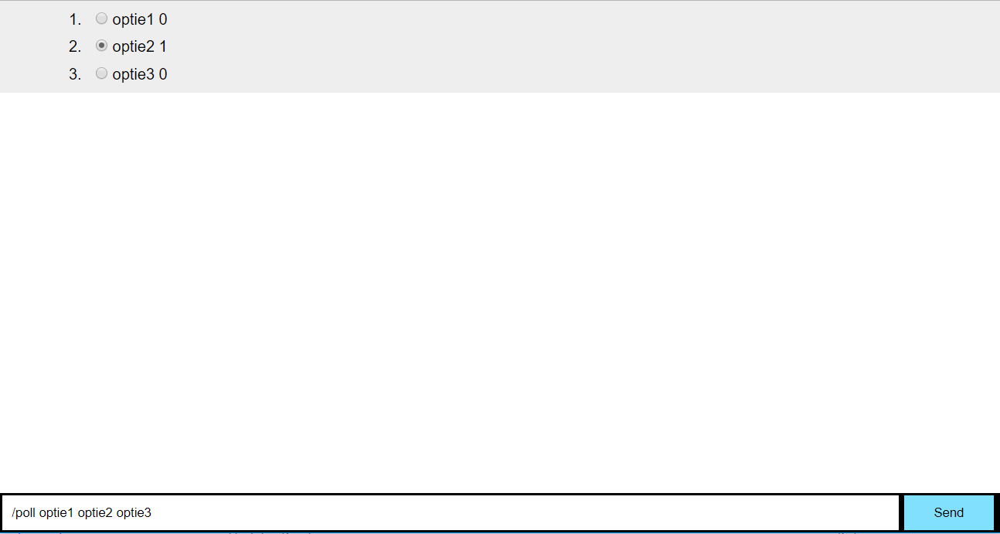

# Send Polls

A realtime web app based on the socket.io dependency. A simple chat with an feature to add polls. When connected with another computer you can see eachothers votes.


> A screenshot of the app

## Background

This app is a basic chat app. You can send eachother messages. Next to this you can send polls. When on the page you can choose a poll. It wil add up a number and you can see which poll is choose the most.

## Features

**Using socket.io**
```javascript
 socket.on()
 socket.emit()
```

**How to create polls**
```
/poll optie1 optie2 optie3
```

## Prerequisites
* Git
* Node
* NPM

## TO DO

* Add styling
* Add users
* Poll creating
* Showing wich poll has the preference

## Set up
**1. Clone repository:**
```
git clone https://github.com/jelleoverbeek/real-time-web.git
```
**2. Install dependencies:**
```json
{
"dependencies": {
    "express": "^4.15.2",
    "nunjucks": "^3.1.2",
    "socket.io": "^2.1.0"
  }
} 
```

To install all you do:
```
npm install
```

**3. Build and start server:**
```
node server.js
```

**4. Open the app**

Open [localhost:3000](localhost:3000) in your browser to see the app

## License
GPL-3.0 © Jelle Overbeek